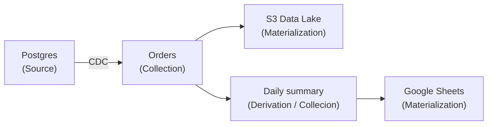

```mermaid
flowchart LR
    A["Postgres
    (Source)"] -->|CDC| B["Orders
    (Collection)"]
    B --> C["S3 Data Lake
    (Materialization)"]
    B --> D["Daily summary
    (Derivation / Collecion)"]
    D --> E["Google Sheets
    (Materialization)"]
```
